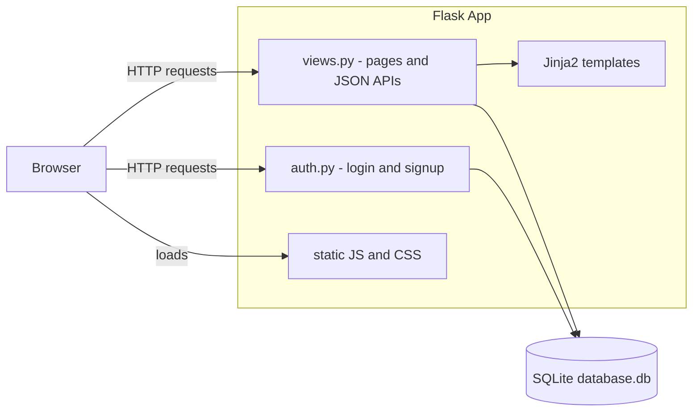
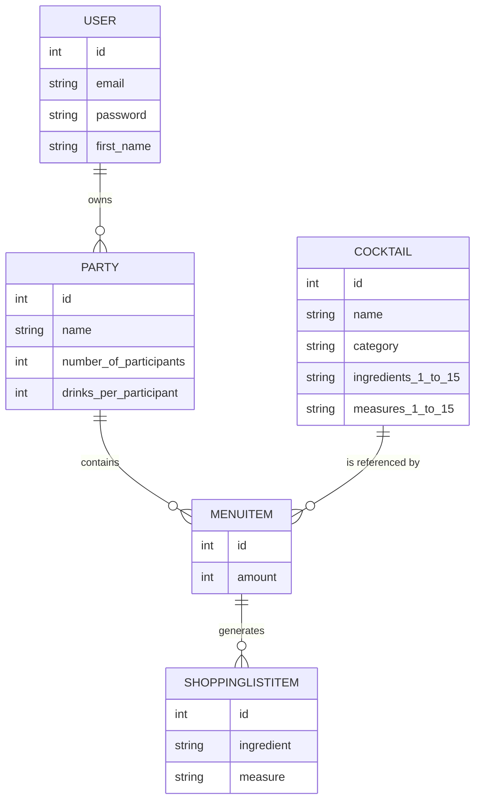
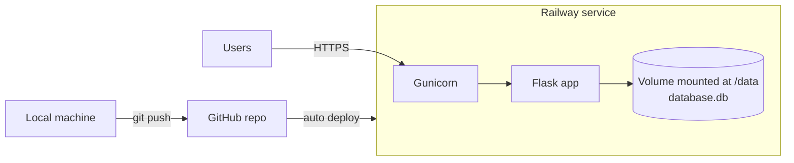

# Mixly – Architecture

Mixly is a party-planning web app: create a party, pick cocktails from a catalog of 633 drinks, and get an automatically aggregated shopping list.

It is built as a classic **server-rendered Flask monolith** — one process serves the HTML pages, the JSON endpoints, and the static assets, backed by a single SQLite database.

## Tech Stack

| Layer | Technology |
|---|---|
| Backend | Python, Flask |
| ORM / Database | Flask-SQLAlchemy, SQLite |
| Authentication | Flask-Login (session cookies) |
| Frontend | Jinja2 templates, vanilla JavaScript, custom CSS |
| Production server | Gunicorn |
| Hosting | Railway (single service + persistent volume) |

## Project Structure

```
cocktailWebsite_new/
├── main.py                     # Entry point: creates the app, runs dev server
├── Procfile                    # Production start command (gunicorn)
├── requirements.txt            # Python dependencies
└── website/
    ├── __init__.py             # App factory: config, DB init, blueprints, seeding
    ├── models.py               # SQLAlchemy models
    ├── views.py                # Main routes (parties, search, JSON APIs)
    ├── auth.py                 # Login / sign-up / logout
    ├── seed.py                 # Fills cocktail table on first start
    ├── utils/                  # Shopping list aggregation helpers
    ├── jobs/
    │   ├── cocktails_seed.json # Bundled cocktail catalog (633 drinks)
    │   ├── export_cocktails_seed.py  # Regenerates the seed file from a local DB
    │   └── ...                 # Original RapidAPI import scripts (one-off)
    ├── templates/              # Jinja2 HTML pages
    └── static/                 # index.js + styles.css
```

## Application Flow



- **Pages** (`/`, `/cocktailsearch`, `/partydetails`, `/login`, `/sign-up`) are rendered server-side with Jinja2.
- **JSON endpoints** (`/add-cocktail-to-party`, `/delete-party`, `/delete-menu-item`) are called from `static/index.js` via `fetch`.
- **Auth** uses Flask-Login session cookies; all main pages require login.

## Data Model



- `Cocktail` stores up to 15 ingredient/measure pairs as flat columns (mirrors TheCocktailDB API shape).
- When a cocktail is added to a party, `Shoppinglistitem` rows are created per ingredient; `utils/` aggregates them into the shopping list shown on the party details page.

## Configuration

All environment-specific settings come from environment variables, with safe local defaults:

| Variable | Local default | Production (Railway) |
|---|---|---|
| `SECRET_KEY` | `dev-only-fallback` | Random 64-char hex secret |
| `DATABASE_PATH` | `instance/database.db` | `/data/database.db` (volume) |
| `FLASK_DEBUG` | unset (off) | never set |

## Cocktail Seeding

The cocktail catalog was originally imported from TheCocktailDB (RapidAPI) by the scripts in `website/jobs/`. Since the API key is no longer needed at runtime, the catalog now ships with the repo:

1. `website/jobs/cocktails_seed.json` contains all 633 cocktails.
2. On every app start, `website/seed.py` checks whether the `cocktail` table is empty.
3. If empty (fresh database/volume), it loads the JSON and inserts all rows. Otherwise it does nothing.

This makes deployments self-contained: a brand-new environment gets the full catalog automatically, with no external API dependency.

## Deployment (Railway)



- **One service** runs `gunicorn main:app --bind 0.0.0.0:$PORT` (see `Procfile`).
- **Persistent volume** mounted at `/data` holds the SQLite file, so users, parties, and cocktails survive redeploys and restarts.
- **Deploys** happen automatically on every push to `main`.
- TLS/HTTPS is handled by Railway.

The database files themselves (`*.db`, `instance/`) are excluded from git — only the JSON seed travels with the code.

## Local Development

```powershell
pip install -r requirements.txt
$env:FLASK_DEBUG = "1"   # enables auto-reload
python main.py            # http://127.0.0.1:5000
```

The local database lives in `instance/database.db` and is created (and seeded with cocktails) automatically on first start.

## Known Limitations

- **Passwords are stored in plaintext** — acceptable for a private demo, must be fixed (hashing + rate limiting) before opening to the public.
- SQLite handles one writer at a time — fine at friends-scale, would need PostgreSQL for serious concurrent traffic.
- Cocktail images are hotlinked from TheCocktailDB's CDN.
